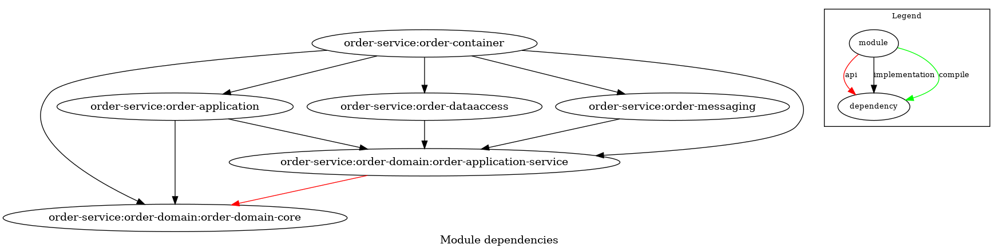
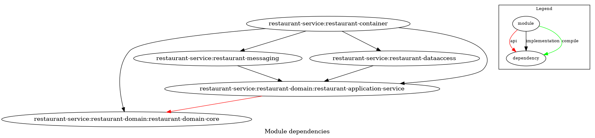
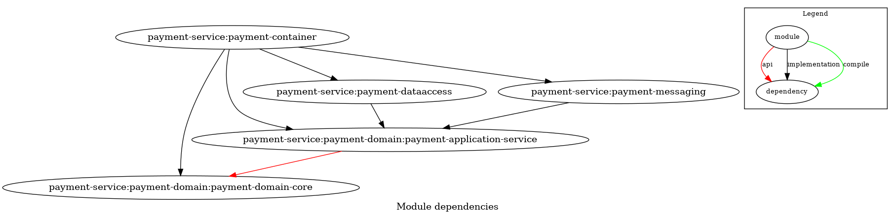
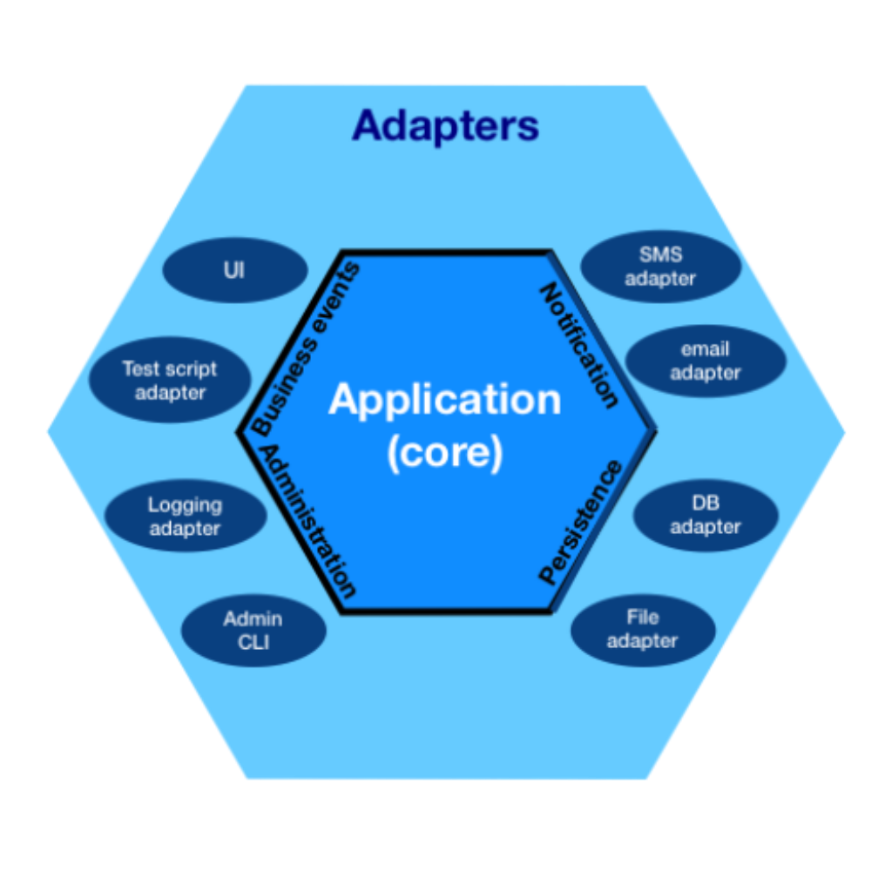
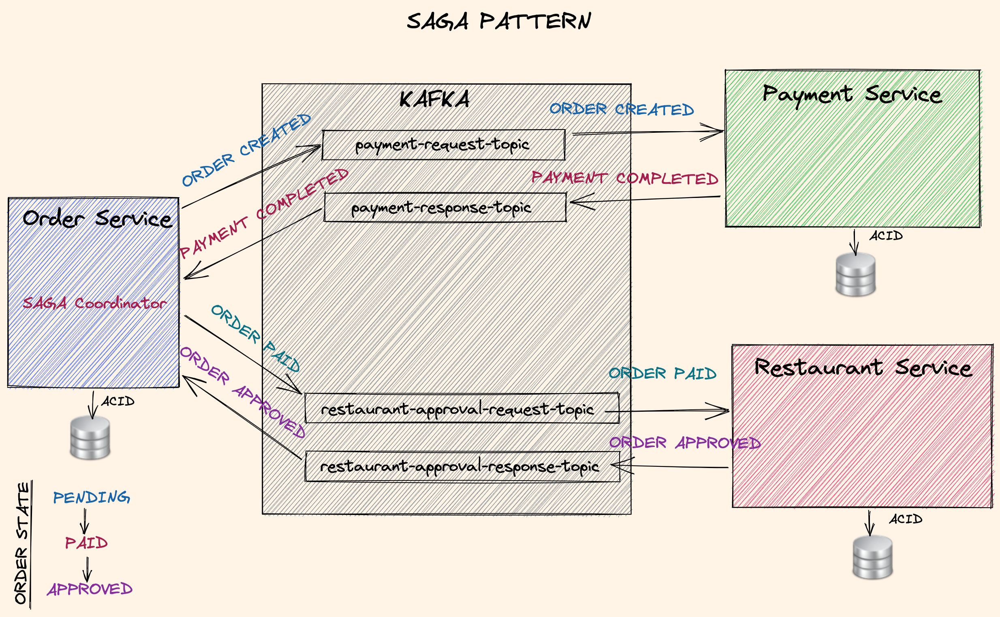
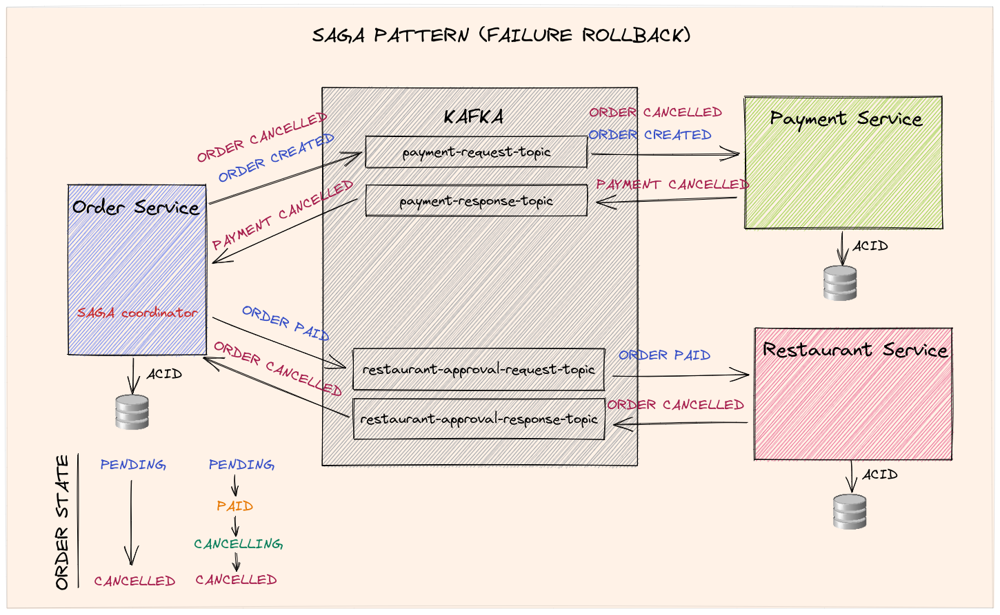

# 모의 주문 시스템

Hexagonal 아키텍처와 Choreography Saga 패턴을 활용하여 구현한 모의 주문 시스템입니다. 아래 Udemy 강의를 수강한 내용을 토대로 구현하였습니다.

https://www.udemy.com/course/microservices-clean-architecture-ddd-saga-outbox-kafka-kubernetes/

SQL로 mocking 데이터를 생성하여 해당 데이터로만 실행 테스트를 진행했습니다. 또한, 코어 서비스가 아닌 customer-service 및 식당/음식 CRUD API의
구현은 생략했습니다. 주문에 관련된 2개의 REST API만 구현하여, 아직은 mocking 데이터를 활용하여 주문 및 주문 확인만 가능한 상태입니다.

### 리팩토링 완료

- order-service
- payment-service
- restaurant-service

## 사용 기술

- Java 17 (Java 11까지의 기능만 활용)
- PostgreSQL
- Spring Boot
- Spring Data JPA
- Kafka
- Mapstruct
- Docker

## 인프라 환경 실행

`infra/docker-compose`

위 디렉토리에 PostgreSQL, ZooKeeper, Kafka에 대한 docker compose 파일이 위치해있습니다.

아래 순서로 실행시키면 됩니다.

1. `docker compose -f postgresql.yml up -d`
2. `docker compose -f common.yml -f zookeeper.yml up -d`
3. `docker compose -f common.yml -f kafka_cluster.yml up -d`
4. [optional] `docker compose -f init_kafka.yml up`

~~`init_kafka.yml`는 topic을 생성시키는 compose 파일이므로 처음에 한번만 실행시키면 됩니다.~~

KafkaAdmin과 Topic을 Bean으로 등록해두었으므로, 어플리케이션 실행시 자동으로 topic이 등록됩니다.

**주의할 점**

Kafka broker의 `/var/lib/kafka/data` 에 볼륨 마운트 설정을 해놓았으므로, `infra/docker-compose` 내부에 반드시
`volumes/kafka/broker-1` , `volumes/kafka/broker-2`, `volumes/kafka/broker-3` 폴더를 생성해주어야합니다.

그렇게 하지 않는다면, docker가 root 권한으로 폴더를 생성하기 때문에 Kafka broker으로의 마운트가 실패하고 컨테이너 실행도 실패하게 됩니다.

## 프로젝트 구조

<p align="middle">
    
    <text>[order-service 의존성 그래프]</text>
</p>

<p align="middle">
    
    <text>[restaurant-service 의존성 그래프]</text>
</p>

<p align="middle">
    
    <text>[payment-service 의존성 그래프]</text>
</p>

<p align="middle" >
    
    <text>[헥사고날 아키텍처 - wiki]</text>
</p>

각 프로젝트는 헥사고날 아키텍처로 구성되어 있고, 다음과 같은 서브 프로젝트로 이루어져 있습니다.

헥사고날 아키텍처는 육각형의 형태로 나타낼 수 있습니다. 중심쪽에 해당하는 서브 프로젝트부터 설명하겠습니다.

### {domain name}-domain-core

엔티티와 최소단위의 비즈니스 로직이 구현되어 있는 레이어입니다. 육각형의 가장 안쪽에 해당합니다.

### {domain name}-application-service

domain-core 레이어에 구현한 로직과 ports를 활용하여 더욱 복잡한 로직이 구현되어 있는 레이어입니다.

Input adapter는 해당 레이어에 구현된 input port를 이용합니다.

Output adapter는 output port의 구현체입니다. 해당 레이어는 Output port를 통해 Output adapter와 통신합니다.

### {domain name}-application

Input adapter가 위치한 서브 프로젝트입니다.

### {domain name}-dataaccess

데이터 접근을 위한 output adapter가 위치한 서브 프로젝트입니다.

JPA entity와 repository가 구현되어 있습니다.

### {domain name}-messaging

메세지 큐를 위한 adapter가 위치한 서브 프로젝트입니다.

해당 프로젝트에서는 Kafka를 사용했습니다.
Kafka Listener는 input adapter이고 Kakfa Publisher는 output adapter라 헥사고날 아키텍처 측면에서는 다른 분류이지만
메세지 큐에는 두 가지 요소가 항상 같이 존재하므로 해당 서브 프로젝트에 같이 위치시켰습니다.

### {domain name}-container

해당 서브 프로젝트에서는 모든 레이어를 참조하여 엮어서 프로그램으로서 실행될 수 있도록 합니다.

해당 프로젝트에서는 Spring Boot를 이용했습니다.

## REST API Spec

---

**POST /orders**

- Request Body

``````
{
  "customerId": "49f72dbd-ae1d-4f6b-b17c-122d402e55c5",  // 고객 ID (UUID 형식)
  "restaurantId": "d215b5f8-0249-4dc5-89a3-51fd148cfb45",  // 음식점 ID (UUID 형식)
  "orderAddress": {
    "street": "street_1",  // 도로명 주소
    "postalCode": "1000AB",  // 우편번호
    "city": "Amsterdam"  // 도시명
  },
  "price": 200.00,  // 총 주문 가격
  "items": [  // 주문 항목 배열
    {
      "productId": "d215b5f8-0249-4dc5-89a3-51fd148cfb48",  // 제품 ID (UUID 형식)
      "quantity": 1,  // 수량
      "price": 50.00,  // 개당 가격
      "subTotal": 50.00  // 합계
    },
    {
      "productId": "d215b5f8-0249-4dc5-89a3-51fd148cfb48",  // 제품 ID (UUID 형식)
      "quantity": 3,  // 수량
      "price": 50.00,  // 개당 가격
      "subTotal": 150.00  // 합계
    }
  ]
}
``````

- 성공 응답 (HTTP 상태 코드: 200 OK)

``````
{
    "orderTrackingId": "6688de1d-a5ba-4f7f-af17-4a16fd7f833b",
    "orderStatus": "PENDING",
    "message": "Order Created Successfully"
}
``````

- 실패 응답 (HTTP 상태 코드: 400 BAD REQUEST)

``````
{
    "code": "Bad Request",
    "message": {실패 사유}
}
``````

---
**GET /orders/{orderTrackingId}**

- 요청 예시

``````
GET /orders/f410ab7d-8678-49b4-84d6-35c00933932e
``````

- 성공 응답 (HTTP 상태 코드: 200 OK)

``````
{
    "orderTrackingId": "f410ab7d-8678-49b4-84d6-35c00933932e",  // 주문 추적 ID (UUID 형식)
    "orderStatus": "APPROVED",  // 주문 상태 (예: APPROVED, PAID, APPROVED)
    "failureMessages": [  // 실패 메시지 배열 (주문이 성공적으로 처리되면 빈 배열)
        ""
    ]
}
``````

- 실패 응답 (HTTP 상태 코드: 400 BAD REQUEST)

``````
{
    "code": "Not Found",
    "message": "Could not find order with tracking idf430ab7d-8678-49b4-84d6-35c00933932e"
}
``````

## 메세지 플로우

<p>
    
</p>

### 정상 실행 흐름

1. Order Service에 주문이 요청되고, 주문 데이터를 생성합니다. 초기 주문 상태는 PENDING 입니다.
2. Order Service에서 해당 주문에 대한 결제 요청을 Payment Service로 보냅니다. (ORDER CREATED)
3. 결제가 완료되면, Payment Service에서 Order Service로 완료 메세지를 보냅니다. (PAYMENT COMPLETED)
4. 해당 메세지를 수신한 Order Service는 주문 상태를 PENDING에서 PAID 로 바꿉니다.
5. Order Service에서 해당 주문에 대한 식당의 승인을 받기위해 Restaurant Service에 승인 요청을 보냅니다. (ORDER PAID)
6. 승인이 완료되면, Restaurant Service에서 Order Service로 완료 메세지를 보냅니다.(ORDER APPROVED)
7. 해당 메세지를 수신한 Order Service는 주문 상태를 APPROVED로 바꿉니다.

<p>
    
</p>

### 결제 실패시

결제 실패시, 주문 상태를 PENDING에서 CANCELLED로 바꾸고 실패처리합니다.

### 식당 승인 거부 및 실패시

식당 승인 요청을 하기 위해서는 결제가 성공적으로 완료되어야하기 때문에, 해당 주문의 현재 주문상태는 PAID 입니다.

1. 식당 승인이 실패하거나 거부되었을 경우, Restaurant Service에서 승인 실패 메세지를 보냅니다. (ORDER CANCELLED)
2. 해당 메세지를 수신한 Order Service는 주문 상태를 PAID 에서 CANCELLING 으로 바꿉니다.
3. Order Service는 결제를 철회하기 위해 Payment Service에 결제 철회 메세지를 보냅니다. (ORDER CANCELLED)
3. 결제가 성공적으로 철회되면, Payment Service는 Order Service에 완료 메세지를 보냅니다. (PAYMENT CANCELLED)
4. 해당 메세지를 수신한 Order Service는 주문 상태를 CANCELLED 로 바꾸고 실패처리합니다.