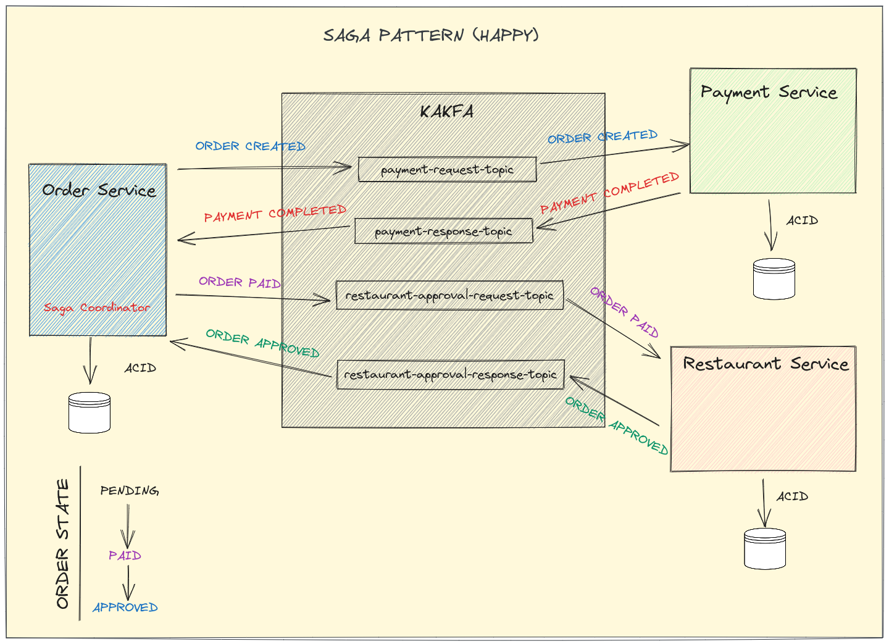
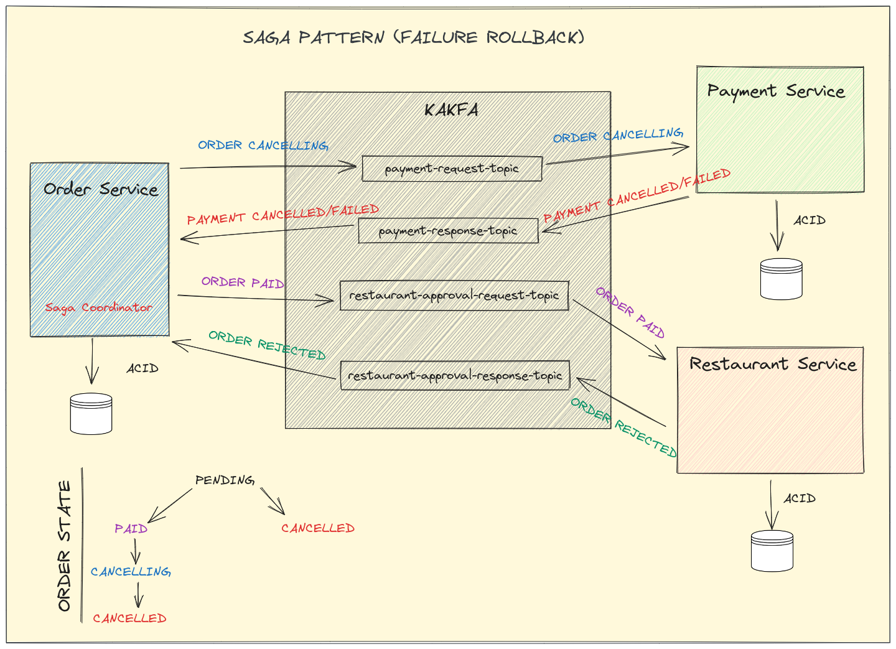

## [[return]](../README.md)

## 메세지 흐름에 대한 설명

### 정상 실행 흐름

    

1. **PENDING**

Order Service에 주문이 요청되고, PENDING 상태의 주문 정보를 생성합니다. 주문 정보가 생성된 이후에는 OrderCreated 이벤트가 발행됩니다.

2. **PAID**

Payment Service에서 OrderCreated 이벤트를 수신하고, 이벤트와 연관된 주문에 대한 결제를 처리합니다. 결제가 완료되면, PaymentCompleted 이벤트가 발행됩니다.

Order Service는 PaymentCompleted 이벤트를 수신하고, 주문 정보의 상태를 PAID로 변경시킵니다. 이후 OrderPaid 이벤트가 발행됩니다.

3. **APPROVED**

Restaurant Service에서 OrderPaid 이벤트를 수신하고, 주문을 곧바로 승인합니다. 이후 OrderApprovalCompleted 이벤트가 발행됩니다.

Order Service는 OrderApprovalCompletedEvent를 수신하고, 주문 정보의 상태를 Approved로 변경시킵니다.

_* APPROVED 단계의 경우, 현재 OrderPaid 이벤트를 수신하자마자 주문을 승인하는 구조입니다. 이를 식당의 승인을 직접 받아 주문을 승인하는 방식으로 수정할 예정입니다._

### 실패 실행 흐름

    

### 주문에 대한 결제 실패

Payment Service에서 결제가 실패하면 PaymentFailed 이벤트가 발행됩니다.

Order Service는 PaymentFailed 이벤트를 수신하고, 주문 상태를 PENDING에서 CANCELLED로 변경시킵니다.

### 식당 승인 거부 및 실패

식당에 승인 요청을 하는 시점의 주문 상태는 PAID입니다. 승인의 거부 및 실패시 OrderRejected 이벤트가 발행됩니다.

1. **CANCELLING**

Order Service는 OrderRejected 이벤트를 수신하고, 주문 정보의 상태를 PAID에서 CANCELLING으로 변경시킵니다. 이후 OrderCancelling 이벤트가 발행됩니다.

2. **CANCELLED**

Payment Service는 OrderCancelling 이벤트를 수신하고, 결제를 취소처리합니다. 이후 PaymentCancelled 이벤트가 발행됩니다.

Order Service는 PaymentCancelled 이벤트를 수신하고, 주문 정보의 상태를 CANCELLED로 변경시킵니다.